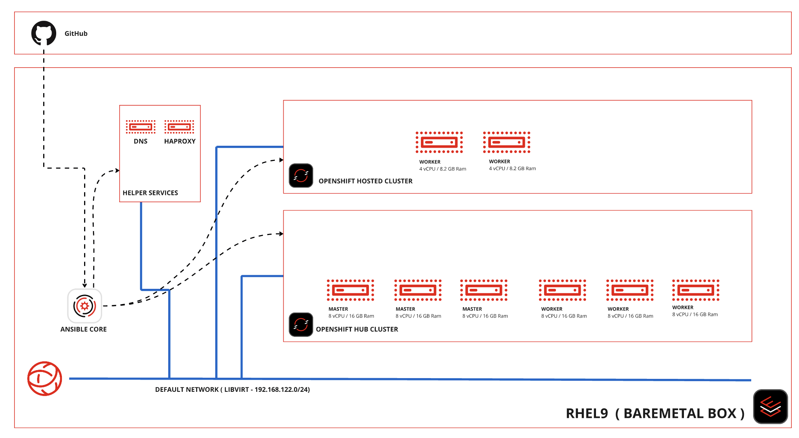

# hcp-on-bm
HCP on BareMetaal

This Repo will host the process for deploying a Hosted Control Plane cluster on a Hub Cluster installed on a single bare metal node. 




## Getting Started

Start with freshly installed RHEL9 OS on the BM. And make sure you have valid subscriptions and 

```
subscription-manager register
yum install ansible-core -y 
```

Also download `rhel-9.4-x86_64-kvm.qcow2` from access.redhat.com/downloads. 

Pull the Ansible Repo

```
git clone https://github.com/v2pkthakur/hcp-on-bm.git
cp rhel-9.4-x86_64-kvm.qcow2 hcp-on-bm/roles/setup-bm-host/files/

cd hcp-on-bm
ansible-playbook playbook.yaml
```

